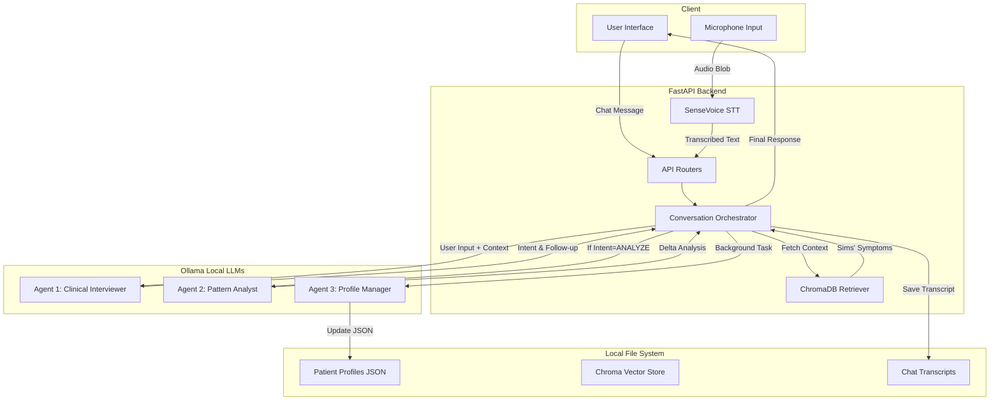

# Serinity System Architecture

Serinity is designed as a modular, local-first multi-agent system. The architecture prioritizes data privacy, robust clinical safety, and low-latency offline execution.

## System Diagram

## Agentic Workflow Deep Dive

Serinity replaces the traditional single-prompt chatbot approach with a **Multi-Agent Pipeline** to ensure clinical rigor:

### 1. Agent 1: The Clinical Interviewer (Frontend Facing)
- **Role:** Handles the immediate conversation, builds rapport, and applies the "Therapeutic Alliance" rules. 
- **Mechanism:** It reads the user's message and outputs strict JSON defining an `intent` (CONTINUE, QUERY, or ANALYZE) and an `assistant_message`. It is strictly forbidden from offering unsolicited advice.

### 2. Agent 2: The Pattern Analyst (Conditional Trigger)
- **Role:** Only triggered when Agent 1 determines enough substantive dialogue has occurred (Intent = ANALYZE).
- **Mechanism:** It performs a "delta analysis" between the user's historical profile and the current session, searching for emerging risk factors or changes in emotional themes without breaking the conversational flow.

### 3. Agent 3: The Profile Manager (Background Worker)
- **Role:** Maintains longitudinal memory.
- **Mechanism:** After the session ends or at set intervals, this agent runs in the background. It reads the session transcript and updates the user's permanent JSON profile across 8 specific domains (e.g., `emotional_themes`, `protective_factors`). It ensures the bot "remembers" the patient's history in future sessions without needing a massive context window.

## Local vs. Cloud Components

Serinity is **100% Local-First**.

| Component | Technology | Execution Environment |
| :--- | :--- | :--- |
| **Frontend UI** | Next.js, React, Tailwind | Local Browser (localhost:3000) |
| **Backend API** | Python, FastAPI | Local Server (localhost:8000) |
| **Speech-to-Text** | SenseVoice | Local Device |
| **LLM Inference** | Ollama (Qwen2.5 7B) | Local Device (CPU/GPU/NPU) |
| **Embeddings** | Nomic-Embed-Text | Local Device |
| **Vector Database**| ChromaDB | Local File System |
| **Patient Data** | JSON / TXT | Local File System |

*No data is transmitted to OpenAI, Google, Anthropic, or any third-party server during normal operation.*
