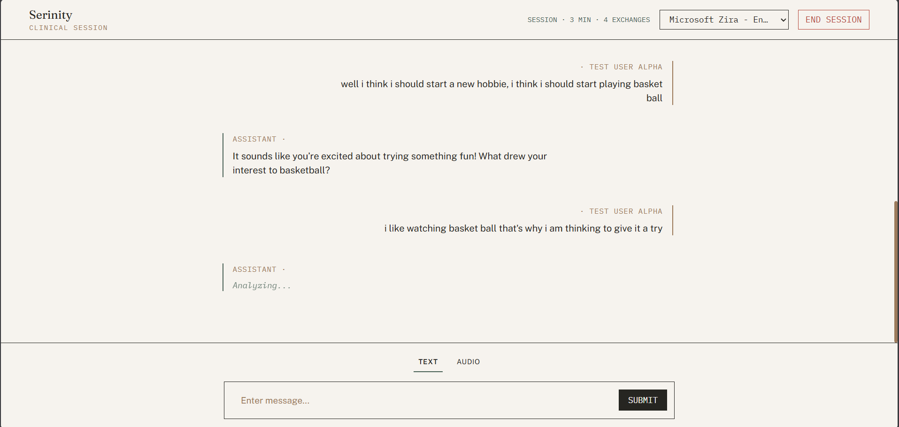
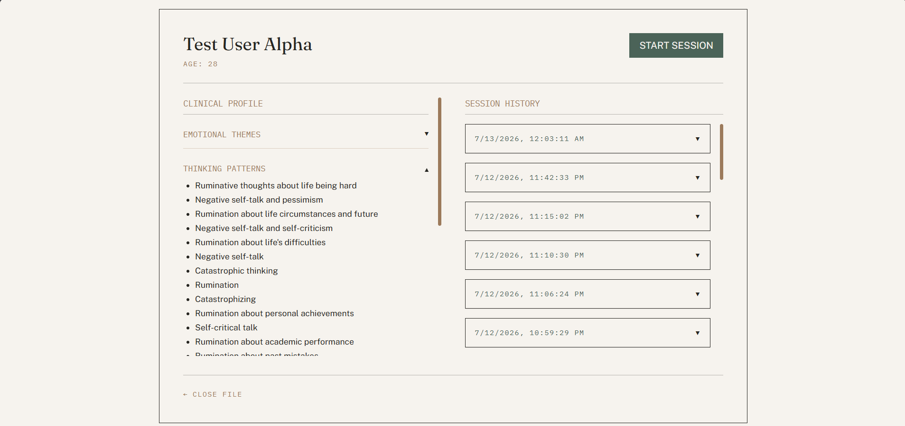
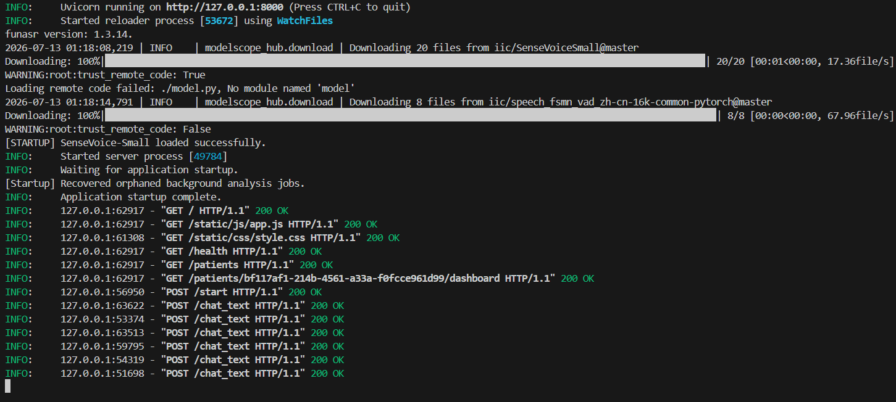

# Serinity: Local-First AI Psychiatrist

**Serinity** is an offline-first, highly empathetic Conversational AI system designed to conduct rigorous clinical interviews, track mental health trajectories over time, and provide emotional support—all while ensuring 100% data privacy by running entirely on-device.

## Screenshots




###  [Demo Video Placeholder]
*(Insert YouTube/Loom Link Here - 2-3 minutes showing the problem, solution, and on-device AI working)*

##  The Problem
Mental health resources are scarce, expensive, and heavily stigmatized. While cloud-based LLM chatbots offer a potential solution, they introduce severe privacy risks. Users are rightfully terrified of sharing their deepest traumas, suicidal ideations, or relationship struggles with a cloud server that might train on their data or suffer a breach. 

Furthermore, general-purpose AIs suffer from "Helpful Assistant Syndrome"—they offer premature advice and toxic positivity rather than acting as professional, empathetic listeners.

##  The Solution
Serinity solves this by operating as a **Local-First, Multi-Agent System**:
- **100% Private**: Audio processing, Vector Database (RAG), and LLM inference happen entirely on your local hardware. No user data ever leaves the machine.
- **Clinically Grounded**: Powered by a Retrieval-Augmented Generation (RAG) pipeline loaded with psychiatric literature (like *Sims' Symptoms in the Mind*), allowing the bot to conduct structured clinical interviews.
- **Agentic Memory**: Uses a background agent to continually update a structured "Clinical Profile" across 8 domains (Emotional Themes, Behavioral Patterns, Risk Assessment) to track patient trajectories over multiple sessions.

---

##  Setup Instructions

### Prerequisites
1. **Python 3.10+**
2. **Ollama**: Must be installed locally and running.
   ```bash
   # Pull the required embeddings and chat model
   ollama pull nomic-embed-text:latest
   ollama pull qwen2.5:7b-instruct
   ```
3. **FFmpeg**: Required for audio processing. Make sure it's added to your system PATH.

### Installation

1. **Clone the repository:**
   ```bash
   git clone https://github.com/yourusername/serinity.git
   cd serinity
   ```

2. **Backend Setup (FastAPI):**
   ```bash
   # Create a virtual environment
   python -m venv .venv
   
   # Activate it (Windows)
   .venv\Scripts\activate
   
   # Install dependencies
   pip install -r requirements.txt
   ```

3. **Environment Variables:**
   Create a `.env` file in the root directory. You do *not* need an API key for the core local features, but ensure the following are set if testing the optional cloud fallbacks:
   ```env
   # Ollama local inference
   OLLAMA_HOST=http://localhost:11434
   LLM1_MODEL=phi4-mini
   LLM2_MODEL=qwen2.5:7b-instruct
   EMBEDDING_MODEL=nomic-embed-text
   
   # HuggingFace model cache — store inside the project so everything is self-contained
   HF_HOME=./models
   
   # ChromaDB local vector store
   CHROMA_PERSIST_DIR=./chroma_db
   CHROMA_COLLECTION_NAME=mhcva-knowledge
   
   # SQLite memory store
   MEMORY_DB_PATH=./data/seren.db
   
   # Debug logs directory
   LOG_DIR=./logs
   
   # Working memory window (number of raw turns to keep in active context)
   WORKING_MEMORY_TURNS=20
   ```

---

##  Run Commands

To start the application, you only need to run the backend server, which also serves the frontend templates.

**Terminal (Backend):**
```bash
.venv\Scripts\activate
uvicorn main:app --reload
```
*The full application will be available at `http://localhost:8000`*

---

##  Sample Inputs and Expected Outputs

**User:** "I've been feeling really isolated lately. My exams are coming up and I have no friends to talk to."

**Expected Output (Serinity):**
*The bot correctly suppresses the urge to give unsolicited advice, prioritizing Therapeutic Alliance.*
> "It sounds really isolating to be studying so intensely without your friends around. Balancing that exam pressure while feeling lonely is incredibly tough. I'm here to listen. When did this feeling of being stuck first start?"

**Behind the Scenes (Clinical Profile Update):**
The background Profile Manager agent silently updates the user's local JSON profile:
```json
{
  "emotional_themes": ["Intense feelings of isolation and loneliness", "Exam-related stress"],
  "behavioral_patterns": ["Withdrawing due to study pressures"],
  "risk_assessment": "No safety concerns identified. Patient is seeking emotional support for situational stress."
}
```

---

##  Documentation
For a deeper dive into the system design, please see the following documents:
- [ARCHITECTURE.md](ARCHITECTURE.md) - System diagrams and data flow.
- [TECHNICAL_REPORT.md](TECHNICAL_REPORT.md) - Specs, metrics, safety protocols, and attribution.
